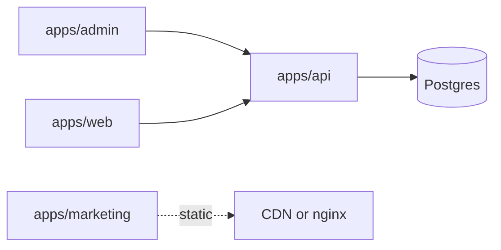

# Mestryx Multisite Platform

Open-source **multi-brand CMS / multisite SaaS** by **Mestryx** — TypeScript monorepo (API, admin, SSR storefronts, optional marketing site).

| | |
|---|---|
| **Working name** | **mestryx-platform** |
| **Licence** | [Apache-2.0](LICENSE) — see also [NOTICE](NOTICE) (trademark) |
| **Security** | [SECURITY.md](SECURITY.md) · [docs/SECURITY.md](docs/SECURITY.md) |
| **Contributing** | [CONTRIBUTING.md](CONTRIBUTING.md) |
| **Repo** | [`Mestryx-dev/SaaS-Multisite-Platform`](https://github.com/Mestryx-dev/SaaS-Multisite-Platform) |
| **Upstream product hosts** | Marketing [`mestryx.dev`](https://mestryx.dev) · demos `demo-*-platform.mestryx.dev` |
| **Stack** | See [`docs/02-stack.md`](docs/02-stack.md) |
| **Not this product** | Piblox = Studio / AI video |

> Marketing legal pages are **CRE drafts** (“not legal advice”). Forks must replace branding, hosts, and contact via `PUBLIC_*` env — see [`apps/marketing/.env.example`](apps/marketing/.env.example).

## Goals

- Many public **sites** / custom **domains**, one **SaaS admin**
- Modular product (CMS, catalog/commerce, billing, analytics — toggles per tenant)
- Shared **design system**, web clients, later **mobile**
- Deploy on your Docker orchestrator; secrets never in git

## Quickstart

```bash
cp .env.example .env
# Set SEED_PASSWORD in .env before seeding (required — no default in source)
docker compose up -d          # Postgres 17 + Redis 7
pnpm install
pnpm --filter @mestryx/api db:migrate
pnpm --filter @mestryx/api db:seed   # optional Luna Bijoux dogfood
pnpm dev:api                  # http://localhost:3001/health
pnpm --filter @mestryx/admin dev
pnpm --filter @mestryx/web dev
pnpm test && pnpm typecheck && pnpm build
```

Marketing (optional):

```bash
cp apps/marketing/.env.example apps/marketing/.env   # set PUBLIC_* for your brand
pnpm --filter @mestryx/marketing dev                 # http://localhost:4321
```

Local compose DB credentials (`postgres`/`postgres`) are **local-only** — never reuse in staging/prod.

## Architecture (apps)

```
apps/api          # Multi-tenant Hono + Drizzle API
apps/admin        # SaaS console (Vite SPA)
apps/web          # Public SSR sites + SEO/AI surfaces
apps/marketing    # Astro product landing (FR/EN)
apps/remotion     # Promo video tooling (optional CI)
packages/ui|tokens|sdk|config|host-resolution
docs/             # Product + ops SSOT
```



## Docs

| Doc | Purpose |
|-----|---------|
| [docs/README.md](docs/README.md) | Full index |
| [docs/app-spec.md](docs/app-spec.md) | Product purpose |
| [docs/runbooks/oss-public-readiness.md](docs/runbooks/oss-public-readiness.md) | Public / OSS checklist |
| [docs/runbooks/staging-dokploy.md](docs/runbooks/staging-dokploy.md) | Staging deploy pattern |
| [docs/runbooks/dev-dokploy-smoke.md](docs/runbooks/dev-dokploy-smoke.md) | Dev smoke pattern (no private IDs) |
| [AGENTS.md](AGENTS.md) | Agent-oriented map |

## Forks & branding

- Apache-2.0 covers **code**; **Mestryx** names/logos are not licensed for rebranded forks ([NOTICE](NOTICE)).
- Replace marketing i18n / `PUBLIC_*` build args; leave Umami empty to disable analytics.
- Package scope `@mestryx/*` is workspace-local (not published to npm).

## Licence

Licensed under the **Apache License, Version 2.0** — see [LICENSE](LICENSE).
