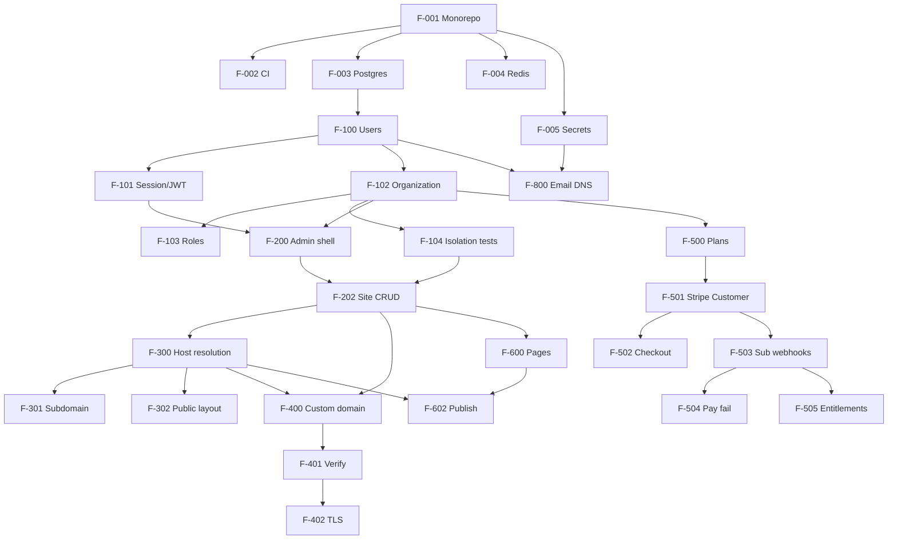
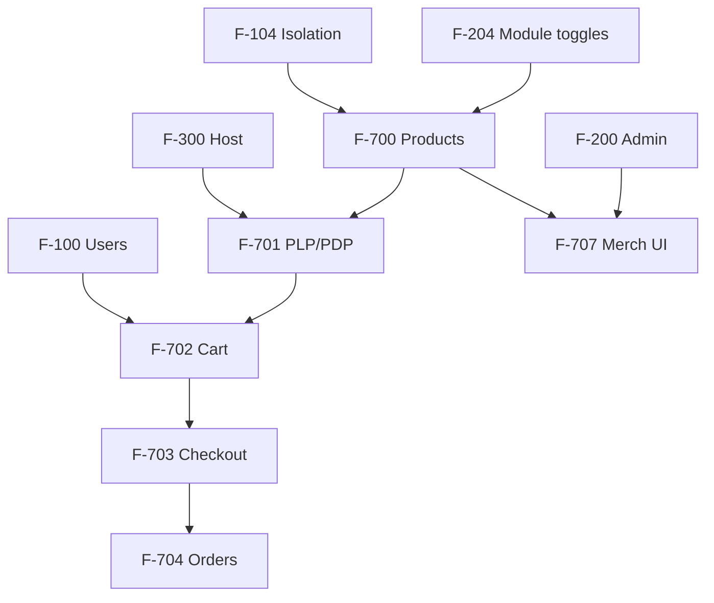

# Dependency graph

Visual and tabular view of **what must exist before what**. Feature IDs from [06-feature-catalog-and-priority.md](./06-feature-catalog-and-priority.md).

## 1. Critical path (Sites OS MVP)

## 2. Critical path (Commerce module add-on)

## 3. Hard constraints (never skip)

| Rule | Detail |
|------|--------|
| **No public site without F-104** | Isolation tests must pass before F-300 in staging |
| **No live billing without F-503+F-504** | Test Stripe failure cards first |
| **No custom domain without F-401+F-402** | Avoid half-configured DNS/TLS |
| **No commerce without F-204** | Module must be toggleable / plan-gated |
| **No mobile before F-900** | Typed API contract first |
| **Email before inviting users** | F-800 before F-107 in production |

## 4. Parallelisable tracks (after F-104)

Once isolation is proven, these can proceed in parallel with different agents:

| Track | Features | Owner focus |
|-------|----------|-------------|
| Admin UX | F-200 → F-205 | `apps/admin` |
| Site runtime | F-300 → F-303 | `apps/web` |
| Billing | F-500 → F-505 | `apps/api` billing module |
| DS | F-206 → F-207 | `packages/ui` |
| Domains | F-400 → F-402 | API + infra |

## 5. Anti-patterns (dependency violations)

- Building Expo (F-902) before OpenAPI SDK (F-900)  
- Custom domains before site CRUD  
- Storybook/Remotion before admin shell  
- GraphQL before REST stabilises  
- Stripe Connect (tenant payouts) before platform subscriptions work  
- Rust workers before any production load metrics  
