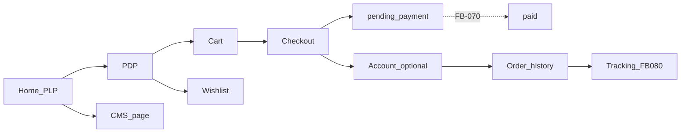

# Journey map — platform admin × storefront

**Date:** 2026-07-19 · **Owner:** Mestryx  
**Owns:** routes / steps and F/FB **references** only.  
**Does not own status** — executable status lives in [feature-backlog.md](./feature-backlog.md). Catalog scope: [06](./06-feature-catalog-and-priority.md). Commerce target scope: [12](./12-commerce-fiscal-complete.md).

---

## Storefront (end-customer)

Paths: `apps/web` · public API `/v1/public/…`

| Step | Route / action | Refs |
|------|----------------|------|
| Shop home (PLP) | `/` | FB-060, FB-063 (`?category=`) · filters/sort **FB-083** |
| PDP | `/p/:slug` | FB-060, FB-062 · reviews **FB-101** (icebox) |
| CMS content page | public page by slug | FB-034 · blocks **FB-075** (F-601) |
| Add to cart | POST `/actions/cart` | FB-060 |
| Wishlist | `/wishlist` | FB-060 · polish **FB-079** (F-709) |
| Cart | `/cart` | FB-060 |
| Checkout | `/checkout` → `pending_payment` | FB-060, FB-066, FB-065 · pay **FB-070** · address book **FB-078** |
| Account sign-in / up | `/account/sign-*` | FB-068, FB-072 |
| Order history | `/account`, `/account/orders/:id` | FB-068 |
| Order tracking (guest / public) | `/orders/track` | FB-080 · polish **FB-104** |
| Product search | — | **FB-074** |
| Promo banners / homepage hero | — | **FB-073** |
| PLP filters + sort | — | **FB-083** |
| Returns / RMA | `/account` returns list · order detail form | **FB-082** · polish **FB-104** |
| Abandoned cart email | — | **FB-081** (F-710) |
| Cookie consent | — | **FB-076** (F-803) |
| Legal pages | stubs → full | **FB-077** (F-303) |
| Security headers / CSP | runtime | **FB-098** (F-807) |

---

## Platform admin (tenant operator)

App: `apps/admin` · SaaS Better Auth (not storefront customer)

| Step | Page / area | Refs |
|------|-------------|------|
| Sign up / sign in | `/sign-up`, `/sign-in` | FB-020 |
| Dashboard | `/` | FB-030 |
| Workspace switcher | shell | F-201 · FB-031 |
| Sites CRUD | Sites | FB-032 |
| Invite members | Members + accept-invite | FB-035 |
| CMS pages | Pages (markdown) | FB-034 · blocks **FB-075** · preview **FB-087** |
| Products / variants / media | Products | FB-060, FB-062, FB-064 |
| Categories | Categories | FB-063 |
| Coupons | Coupons | FB-065 |
| Shipping | Shipping | FB-066 |
| Orders | Orders | FB-061, FB-069 |
| Reports / stock | Reports | FB-071 |
| Billing (SaaS) | Billing | FB-051 · entitlements UX **FB-097** |
| Module toggles | — | **FB-084** (F-204 / F-751) |
| Per-site theme | — | **FB-085** (F-404) |
| CMS media library | — | **FB-086** (F-604) |
| Navigation menus | — | **FB-088** (F-603) |
| Umami | — | **FB-089** (F-802 / F-802a) |
| Super-admin | — | **FB-099** (F-208, icebox) |
| Multi-locale content | — | **FB-100** (F-406, icebox) |

---

## Gaps and next work

- Executable queue / sequencing: [feature-backlog.md](./feature-backlog.md) (Phase 6 gaps + Phase 8).  
- Catalog definitions only: [06](./06-feature-catalog-and-priority.md).  
- Do not maintain a parallel “not built” status list here.

When a journey step’s **scope** changes, edit this map. When **status** changes, edit the backlog only ([10 §2.2](./10-agent-ops.md#22-docs-sync-loop-systematic--mestryx-policy)).
