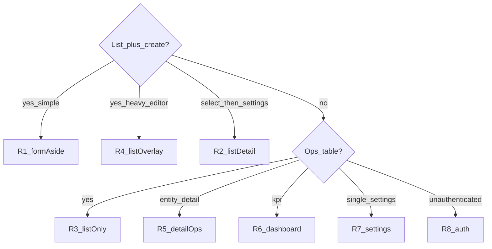

# Admin console — layout recipes (homogeneity)

**Status:** SSOT for which layout pattern each authenticated admin page must follow  
**Created:** 2026-07-28  
**Last updated:** 2026-07-28  
**Related:** [admin-console-master-plan.md](./admin-console-master-plan.md) · [component-directory.md](./component-directory.md) · Storybook **Patterns/ConsoleLayout** · Shipping SoT [`ShippingPage.tsx`](../../apps/admin/src/pages/ShippingPage.tsx)

## Principle

Homogeneous **operating logic** does **not** mean every page uses `SplitLayout`. It means:

1. Pick a **recipe** from the matrix below by IA (list+create, list-only ops, settings, detail, dashboard, auth).
2. Within a recipe family, reuse the **same chrome stack** (`PageContent` → `PageHeader` → optional `FilterBar` → body) and the same density rules.
3. Do **not** force Products/Pages editors or Order detail into `formAside` — overlays / stacked ops panels are intentional.

**Anti-patterns**

- Stacking two full-width `FormPanel`s under a list (pre-2026-07-28 Shipping).
- Using `FormPanel` as a filter strip (use `FilterBar`).
- Marketing-width `max-w-*` on console pages (use `PageContent` `full` / `wide`).
- Hardcoded English `PageHeader.description` / EmptyState when FR catalog exists.

## Recipes

| ID | Name | Primitive stack | When to use |
|----|------|-----------------|-------------|
| **R1** | `formAside` | `PageContent full` → `PageHeader` (eyebrow) → `FilterBar?` → `SplitLayout` (`formAside`) → primary `TableFrame`/`ListPanel` + aside one `FormPanel width="full"` (`FormRow` for dense fields) | Org/site-scoped **list + create** (one create surface) |
| **R2** | `listDetail` | Same header → `SplitLayout variant="listDetail"` → narrow list + wide settings `FormPanel` | Select entity then edit many fields (Sites) |
| **R3** | `listOnly` | Header → `FilterBar` → `TableFrame` (+ optional `BulkActionBar`) | Ops lists with **no** create-aside (Orders) |
| **R4** | `listOverlay` | `listOnly` chrome + create `Dialog` / edit `Sheet` | Heavy multi-section create/edit (Products, Pages) |
| **R5** | `detailOps` | Header + breadcrumb → info panels + **stacked** action `FormPanel`s | Entity detail with lifecycle actions (Order detail) |
| **R6** | `dashboard` | Header → `StatStrip` / KPI cards / charts | Dashboard, Reports |
| **R7** | `settings` | Header → single `FormPanel` or plan cards | Modules, Billing |
| **R8** | `auth` | `AuthShell` + centered `FormPanel` | Sign-in / Sign-up / Accept invite |

### R1 checklist (SoT: Shipping / Categories)

- [ ] `eyebrow={t("nav.section.*")}` + i18n `description`
- [ ] Filters only in `FilterBar` (site / search)
- [ ] Primary: loading `TableSkeleton`, empty `EmptyState` + CTA focusing first create field
- [ ] Aside: **one** `FormPanel`; multiple creates = sections with `border-t`, not second full-width panel under the list
- [ ] Dense fields: `FormRow cols={2|3}` + `FormField size="full"`
- [ ] List actions: fixed `shrink-0` delete; avoid `flex-wrap` for primary actions
- [ ] Soft stack under `lg` (built into `SplitLayout`)

### R3 / R4 notes

- Orders stay R3 (bulk + filters). Products/Pages stay R4 — do not migrate create into a narrow aside.

### R5 notes

- Stacked FormPanels for mark-paid / fulfill / credit are OK; keep vertical rhythm via `Stack gap="md"`; avoid wrapping unrelated settings in the same panel.

## Page ↔ recipe matrix (2026-07-28 audit)

| Page | Route | Recipe | Status | Next action |
|------|-------|--------|--------|-------------|
| Shipping | `/shipping` | R1 | **Done** (2026-07-28) | Smoke on Dev |
| Categories | `/categories` | R1 | Structure OK | Polish: i18n description |
| Coupons | `/coupons` | R1 | Structure OK | Polish: EmptyState CTA + i18n |
| Menus | `/menus` | R1 | Structure OK | Polish: eyebrow + i18n + densify rows |
| Banners | `/banners` | R1 | Structure OK | Polish: eyebrow + EmptyState CTA + i18n |
| Media | `/media` | R1 | Structure OK | Polish: eyebrow + i18n |
| Members | `/members` | R1 | Structure OK | Polish: eyebrow + i18n |
| Sites | `/sites` | R2 | **Keep** | Mild i18n only |
| Orders | `/orders` | R3 | **Keep** | Mild i18n / description |
| Returns | `/returns` | R3 + secondary ops panel | Structure OK-ish | Polish: eyebrow; keep abandoned panel below (not R1) |
| Pages | `/pages` | R4 | **Keep** | Polish: eyebrow + i18n |
| Products | `/products` | R4 | **Keep** | Polish: i18n only (no formAside) |
| Order detail | `/orders/:id` | R5 | **Keep** | Polish: i18n status copy |
| Dashboard | `/` | R6 | **Keep** | Optional eyebrow |
| Reports | `/reports` | R6 | **Keep** | i18n description |
| Billing | `/billing` | R7 | **Keep** | Prefer FormPanel/Card consistency |
| Modules | `/modules` | R7 | **Keep** | Optional eyebrow |
| Sign-in / Sign-up / Accept invite | auth routes | R8 | **Out of scope** for R1 | AuthShell polish only if Wave D follow-up |

## Component inventory (reuse — no new page shell required)

| Piece | Path | Role |
|-------|------|------|
| `PageContent` | `packages/ui/src/patterns/page-content.tsx` | Fluid console width |
| `PageHeader` | `packages/ui/src/patterns/page-header.tsx` | Eyebrow + title + description + actions |
| `FilterBar` | `packages/ui/src/patterns/filter-bar.tsx` | Filters only |
| `SplitLayout` | `packages/ui/src/patterns/split-layout.tsx` | `formAside` \| `listDetail` |
| `TableFrame` / `TableSkeleton` | `packages/ui/src/patterns/*` | List chrome |
| `FormPanel` / `FormRow` / `FormField` | `packages/ui/src/patterns/form-layout.tsx` | Create / settings |
| `EmptyState` | `packages/ui/src/components/empty-state.tsx` | CTA into aside / dialog |
| `ListPanel` | `packages/ui` | Alternate list chrome (Menus) — acceptable under R1 if density matches |

**Component work (optional, YAGNI unless polish stalls):** Storybook story **Recipes matrix** documenting R1–R8; no new React page wrapper until a third R1 page still drifts.

## Homogenization waves (execution)

| Wave | Scope | Est. |
|------|-------|------|
| **G0** | This SSOT + master-plan link + Storybook recipe matrix | 0.5 cycle |
| **G1** | R1 polish: Coupons, Categories, Menus, Banners, Media, Members (i18n, eyebrow, EmptyState CTA, row density) | 1–2 cycles |
| **G2** | R3/R4/R5/R6/R7 mild polish (i18n + eyebrow only; no archetype change) | 1 cycle |
| **G3** | Returns: commerce eyebrow + clarify abandoned panel as secondary ops (not second create) | 0.5 cycle |
| **G4** | Human smoke on Dev admin; tick mvp checklist density if green | Human + 0.5 |

**Out of scope:** forcing Products/Pages into R1; Order detail → formAside; auth redesign; Wave E glass.

## Agent rules

1. Before changing an admin page layout, read this file and assign a recipe ID in the PR/commit body.
2. New list+create commerce/content pages **default to R1** unless the create form needs Sheet/Dialog (then R4).
3. Update this matrix when a page recipe changes.
4. Prefer i18n keys under the page namespace (`shipping.*`, `coupon.*`, …) for descriptions/empties.

## References

- Shipping P0 audit → implementation 2026-07-28 (`feat(admin): align Shipping…`)
- [mvp-confirmation-checklist.md](../mvp-confirmation-checklist.md) §2.1 Density · §2.2 Shipping
- [ux-ui-harmony-checklist.md](./ux-ui-harmony-checklist.md) AD layout rows
