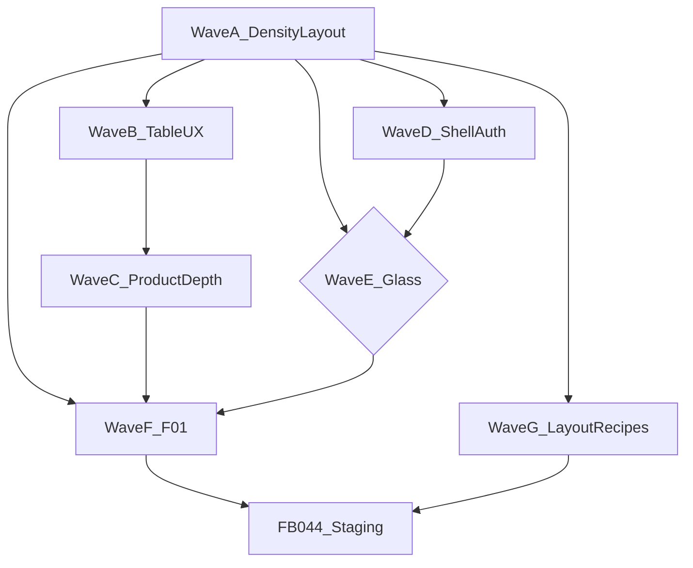

# Admin console — master plan

**Status:** Waves A–D executed (2026-07-20). **UX polish wave** shipped 2026-07-22. **Dokploy cleanliness** shipped 2026-07-22. **Fluid console width** shipped 2026-07-24. **Unified AppShell header** shipped 2026-07-25. Wave E glass deferred. Wave F (F-01) signed 2026-07-25. **Wave G — layout recipe homogeneity** opened 2026-07-28 (R1 SoT Shipping; see [admin-console-layout-recipes.md](./admin-console-layout-recipes.md)).  
**Last updated:** 2026-07-28  
**Related:** [admin-console-layout-recipes.md](./admin-console-layout-recipes.md) · [ux-ui-harmony-checklist.md](./ux-ui-harmony-checklist.md) · [DESIGN.md](../../DESIGN.md) · [PRODUCT.md](../../PRODUCT.md) · [motion-guidelines.md](./motion-guidelines.md)

Full console roadmap for mestryx-platform admin. Nothing is dropped: items are ordered by dependency. Cursor plan mirror: `.cursor/plans/admin_console_density_ea0b142b.plan.md` (name retained historically).

## Objective

Professional admin console end-to-end: density/layout → SaaS 2026 table UX → charts/mobile → shell/auth → optional platform glass → F-01 before staging.

## Waves (summary)

| Wave | Name | Must / Should / Maybe | Depends on | Est. cycles |
|------|------|----------------------|------------|-------------|
| **A** | Density & layout (primitives + all pages) | Must | — | 4–6 |
| **B** | Table UX (chips+URL, density toggle, bulk) | Must / Should | A | 3.5–6 |
| **C** | Saved views, Reports charts, mobile dashboard | Should | B (views); data APIs | 6–10 |
| **D** | Nav polish + auth redesign | Should | A | 2–4 |
| **E** | Platform glass (chrome only) | Maybe | A + DESIGN.md amend + human OK | 0–2 |
| **F** | F-01 brand visuals human sign-off | Must (staging) | Coherent UI (A+D min) | Human |
| **G** | Layout recipe homogeneity | Must | A + Shipping SoT | 3–4 |

## Decision matrix

| Item | Keep? | Wave | Gate |
|------|-------|------|------|
| Layout primitives + page migration | Must | A | — |
| Filter chips + URL sync | Must | B | After A |
| Density toggle | Should | B | TableFrame ready |
| Bulk actions (Orders/Products) | Should | B | APIs |
| Saved views | Should | C | After chips |
| Reports charts | Should | C | Metrics API |
| Mobile-specific dashboard | Should | C | Desktop stable |
| Nav rewrite (list nav polish, Cmd+K, collapse) | Should | D | Not card-nav (B-A15 n/a) |
| Auth redesign (sign-in / up / invite) | Should | D | AuthShell |
| Glass on admin | Maybe | E | Today DESIGN.md = opaque dense; amend only if Mestryx wants chrome blur after A |
| F-01 brand sign-off | Must | F | Blocks FB-044 staging |
| Homogeneous recipes (R1–R8) + R1 polish | Must | G | [layout-recipes](./admin-console-layout-recipes.md) |
| RHF/zod, Calendar, Slider | Park | — | G-11/13/14 until needed |

### Glass (“if needed”)

Default after Wave A: **keep opaque**. Soft boutique glass stays storefront-only per DESIGN.md / motion-guidelines. Wave E only if the dense console feels too flat: chrome-only (`topBar` / optional sidebar), never tables, form panels, or primary CTAs — requires DESIGN.md + motion-guidelines update.

## Wave A — Density & layout (first)

### A0 Primitives (`packages/ui`)

- `PageContent`, `TableFrame` (sticky thead), `SplitLayout` (`formAside` \| `listDetail`)
- `PageHeader` breadcrumb slot
- Storybook Patterns (List / Settings / Split / listDetail); export barrel
- Stack owns vertical rhythm
- Console pages fill AppShell main (`PageContent` `wide`/`full` — no marketing `max-w-7xl`)

### A1 Pilots

Dashboard, Orders, Sites, Products — list-first, FilterBar, EmptyState + Skeleton, distill mega-panels.

### A2 Remaining pages

Categories, Pages, Media, Menus, Coupons, Banners, Shipping, Returns, Members, Billing, Modules, Reports, OrderDetail.

### A3 DoD

Typecheck, Storybook, `pnpm ds:detect` / impeccable detect, CHANGELOG, component-directory, checklist AD layout-pass notes.

**A defaults:** no glass; FilterBar for filters; FormPanel for create/settings only; shadcn CSS vars only.

## Wave B — Table UX

1. Filter chips + URL query sync  
2. Density toggle (comfortable | compact) + localStorage  
3. Bulk actions — Orders then Products  

## Wave C — Product depth

1. Saved views (per user/org)  
2. Reports charts (real metrics)  
3. Mobile-specific dashboard (not squished tables)  

## Wave D — Shell & auth

1. **Nav:** Shell/AppShell polish — collapse, mobile sheet, Cmd+K routes, clearer org chrome; keep list nav  
2. **Auth:** SignIn / SignUp / AcceptInvite visual hierarchy on AuthShell  

## Wave E — Platform glass (conditional)

See decision matrix. Skip unless explicitly approved after A.

## Wave F — F-01

Human validation of brand-brief visuals vs admin + Storybook. Closes checklist F-01 / PROGRESS gate. Unlocks staging FB-044.

## Parked

G-11 Form RHF/zod, G-13 Calendar, G-14 Slider, B-A15 card-nav, drop-in full Studio templates.

## Skills & compliance

- `mestryx-design-system` orchestration; Impeccable detect/distill/layout per wave  
- `saas-frontend-impeccable`: admin density 6–8, low motion  
- No second shadcn tree in apps; PRODUCT/DESIGN win over template aesthetics  

## Estimates

- Wave A alone: **4–6 agent cycles** + review  
- All waves: **~16–28 agent cycles** + human F-01 (high uncertainty on C)  

## Execution status (2026-07-20)

| Wave | Status |
|------|--------|
| A Density & layout | **Done** |
| B Table UX | **Done** (client CSV bulk export on Orders + Products; cancel API still stubbed) |
| C Product depth | **Done** (CSS charts; saved views client-side; mobile KPI strip + KpiBullet) |
| D Shell & auth | **Done** (+ Cmd+K Lucide; RouteFade) |
| UX polish (post A–D) | **Done** (2026-07-22) — EmptyState CTAs, toasts, focus/a11y |
| Dokploy cleanliness | **Done** (2026-07-22) — flat nav, ListPanel lists, surface contrast, status badges |
| E Platform glass | **Deferred** — opaque dense remains; needs DESIGN.md amend + human OK |
| F F-01 sign-off | **Signed** 2026-07-25 — staging gate brand OK |
| G Layout recipes | **In progress** — SSOT [admin-console-layout-recipes.md](./admin-console-layout-recipes.md); Shipping R1 SoT done; G1–G3 polish pending |

## Wave G — Layout recipe homogeneity

**SSOT:** [admin-console-layout-recipes.md](./admin-console-layout-recipes.md)

Same **operating logic** within each recipe family — not “every page is SplitLayout”.

| Sub-wave | Work | Status |
|----------|------|--------|
| G0 | Recipes SSOT + Storybook matrix + master-plan link | Doing |
| G1 | R1 polish (Coupons, Categories, Menus, Banners, Media, Members) | Todo |
| G2 | Mild polish R3–R7 (i18n / eyebrow only) | Todo |
| G3 | Returns secondary-ops clarity | Todo |
| G4 | Dev smoke + checklist density tick | Todo |

**Do not** migrate Products/Pages to R1 or Order detail to formAside.

## Loading system (admin)

Prefer **in-place skeletons** over full-page blockers. Use `@mestryx/ui` presets:

| Context | Pattern |
|---------|---------|
| List / table | `TableFrame` + `TableSkeleton` (or `DataTable loading`) |
| Detail / form wait | `FormSkeleton` or `LoadingBlock` |
| Panel busy | `LoadingOverlay` inside a `relative` parent |
| Full list chrome | `PageSkeleton` |

Storybook: **Patterns/Loading**. Atoms: `Spinner`, Skeleton `variant="shimmer"`.

## Execution rule

Complete **Wave A** before B/C/E. After A ships, pick the next wave explicitly (B, D, or F).
